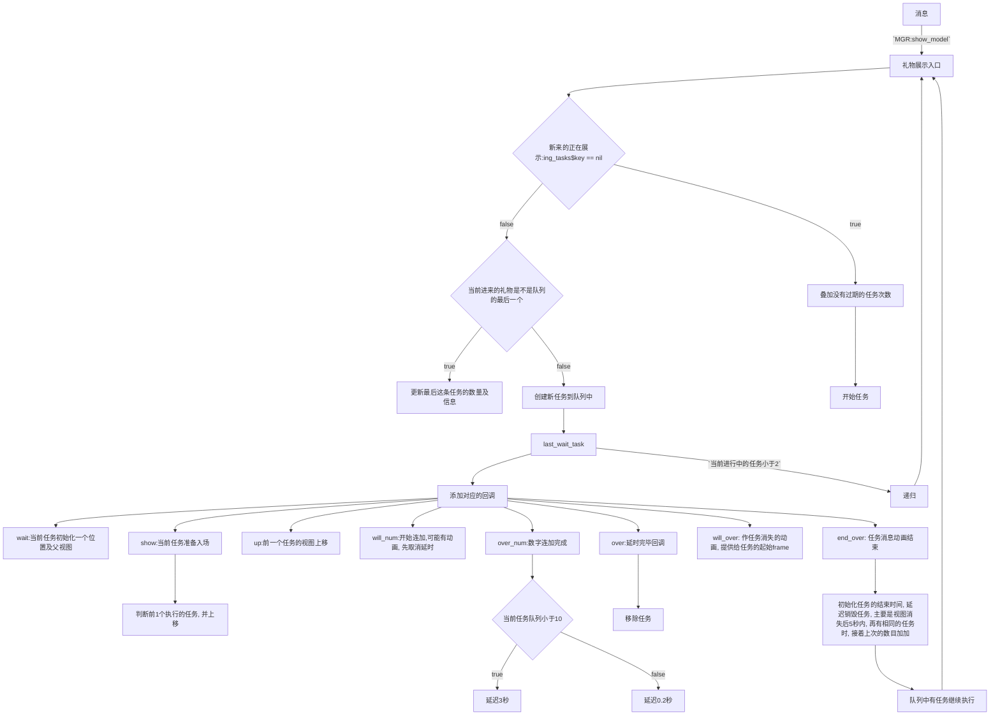

# 废话
### 闲扯
- 好久没写OC相关的东西了, 其他前端语言都是让人睡觉的语言, swift因为没有macro, 直接放弃. 今天的主题是简单实现一个<font color = red>视图复用</font>的<font color = red>礼物连击</font>小案例.

> 关于<font color = red>直播间中礼物连击</font>没有固定的一个实现方案, 因为每种情况下的业务需求不一样, 但其中核心的部分就是`队列 和 数目的连击`, 也看过其他作品的实现, 基本都是用`自定义的operation`来实现任务队列, 控制并发数为1, 但`operation每添加一个任务都会有线程调度`, start后又回主线程, 所以当礼物消息频繁时, 效率就不怎么好了(`这一点至少从逻辑上来讲的确是这样的`). 特别是基本所有的实现都是一个任务就创建一个`view`, 看起来比较直观, 也好管理, 但还是那句话, 效率
> 若不用相应的机制, 自己管理任务, 就稍微麻烦了, 但抛弃线程相关的代码, 从逻辑上来讲效率是有提升的


# 功能
- 视图复用
- 任务队列
- 任务不繁忙时,  视图停留的时间相对宽松
- 连击

# 架构
```shell
├── GiftSend
│   ├── AppDelegate.h
│   ├── AppDelegate.m
│   ├── Base.lproj
│   │   ├── LaunchScreen.storyboard
│   │   └── Main.storyboard
│   ├── SceneDelegate.h
│   ├── SceneDelegate.m
│   ├── ViewController.h
│   ├── ViewController.m
│   ├── gift-mgr
│   │   ├── GiftGifData.h
│   │   ├── GiftGifData.m
│   │   ├── GiftGifView.h
│   │   ├── GiftGifView.m
│   │   ├── GiftShowMGR.h
│   │   ├── GiftShowMGR.m
│   │   ├── GiftTask.h
│   │   ├── GiftTask.m
│   │   ├── ReuseViewPool.h
│   │   └── ReuseViewPool.m
│   ├── main.m
│   ├── server-data
│   │   ├── GiftData.h
│   │   ├── GiftData.m
│   │   ├── User.h
│   │   └── User.m
│   └── tool
│       ├── NSObject+Convenient.h
│       └── NSObject+Convenient.m
```
- 管理所有任务的类`GiftShowMGR`
  - 管理任务(`队列`)
  - 调度任务
 
- 任务类`GiftTask`
  - 执行礼物相关展示的逻辑

- 视图复用池`ReuseViewPool`
  - 提供视图

- 测试类(`ViewController`)

- 其他
  - 数据相关(`服务器礼物, 用户,  礼物状态, 工具类`)


# 步骤简述



<br/>

> 以上是`GiftShowMGR`, 相关代码如下

```objc
@import UIKit.UIView;

@class GiftGifData;

NS_ASSUME_NONNULL_BEGIN

@interface GiftShowMGR : NSObject

- (instancetype)init_with_container_view:(UIView* _Nonnull)container_v;

/** 在show_model之前调用 */
@property (nonatomic,copy) void (^cbk)(GiftShowMGR* mgr, NSInteger e, id _Nullable src);

- (void)show_model:(GiftGifData*)model;

@end


/// .m
//
//  GiftShowMGR.m
//  ReChaoApp
//
//  Created by lb on 2023/3/22.
//

#import "GiftShowMGR.h"
#import "NSObject+Convenient.h"

#import "GiftTask.h"
#import "GiftGifData.h"
#import "GiftData.h"


#define H_GIFT_VIEW (50)
#define W_GIFT_VIEW (200)
#define SPACE_GIFT_VIEW (10)

#define TIME_SHOWING (3)  // over_num ---> over的时间
#define TIME_RESUE (5)  // end_over --> dead


@interface GiftShowMGR()

@property (nonatomic,weak,readonly) UIView* container_v;

/** 正在执行的任务 */
@property (nonatomic,strong) NSMutableDictionary<NSString*, GiftTask*>* ing_tasks;

/** 队列 */
@property (nonatomic,strong) NSMutableArray<GiftTask*>* tasks;


/** over状态下的任务, 所有的任务是 执行任务完成后排队的 */
@property (nonatomic,strong) NSMutableArray<GiftTask*>* history_task;

@end


@implementation GiftShowMGR
- (instancetype)init_with_container_view:(UIView *)container_v{
    if(!container_v)
        return NULL;
    if(self = [super init]){
        self->_container_v = container_v;
        self->_tasks = @[].mutableCopy;
        self->_ing_tasks = @{}.mutableCopy;
        self->_history_task = @[].mutableCopy;
    }
    return self;
}

- (void)setCbk:(void (^)(GiftShowMGR * _Nonnull, NSInteger, id _Nullable))cbk{
    self->_cbk = [cbk copy];
}


- (void)show_model:(GiftGifData*)model{
    if(!model)
        return;

    auto key = model.key;
    if(str_safe(key).length == 0)
        return;


    // 可以复用视图
    if(self.ing_tasks[key]){
        [self.ing_tasks[key] exec:self.ing_tasks[key].count + model.gift.num + [self find_superposition_key:key]]; // 事实上是累加
        return;
    }


    GiftTask* new_task = ({
        GiftTask* tmp_task;
        // 最新的信息就是队列中最后1条, 则不创建, 将数字叠加进去
        if([self.tasks.lastObject.key isEqualToString:model.key]){
            tmp_task = self.tasks.lastObject;
            tmp_task.count += tmp_task.data.gift.num;   // 这里先加
            tmp_task.data = model;
        }else{
            tmp_task =  [GiftTask task_giftdata:model];
        }
        tmp_task;
    });

    [self.tasks addObject:new_task];            // 入队

    new_task.cbk = [self make_task_cbk];


    if(self.ing_tasks.count < 2){
        auto etask = self.tasks.firstObject;

        [self.tasks removeObject:etask];

        [self.ing_tasks setObject:etask forKey:etask.key];

        return [self show_model:etask.data];
    }
}


#pragma mark - 任务相关的回调
- (gerneric_cbk(GiftTask*, void(^_Nullable)))make_task_cbk{

    @Weak(self);
    return gerneric_cbk(GiftTask*, ^){
        @Stro(self);
        if(e >= GiftTaskSta.wait && e <= GiftTaskSta.dead){
            return [self hand_task_life:obj :e :src];
        }
    };
}

- (void)hand_task_life:(GiftTask*)task
                      :(NSInteger)sta
                      :(id _Nullable)src{

    if(sta == GiftTaskSta.wait){
        NSMutableDictionary* dic = src;
        dic.write(@"frame", @(CGRectMake(self.container_v.frame.size.width * -1, self.container_v.frame.size.height - H_GIFT_VIEW, W_GIFT_VIEW, H_GIFT_VIEW)));
        dic.write(@"super", self.container_v);
        return;
    }


    if(sta == GiftTaskSta.show){
        NSMutableDictionary* dic = src;
        double w = W_GIFT_VIEW, h = H_GIFT_VIEW;
        double y = self.container_v.frame.size.height - h;
        double x = -self.container_v.frame.size.width;
        dic.write(@"begin", @(CGRectMake(x, y, w, h)));
        dic.write(@"end", @([self judge_show_frame:task]));
        return;
    }


    // 进入上移的流程, 返回给内部要 上移的位置(frame)
    if(sta == GiftTaskSta.up){
        NSMutableDictionary* data = src;
        // 将要执行的任务的位置
        CGRect will_task_frame = [data.read(@"will-task-frame") CGRectValue];
        // ing-task相对于将要执行的任务的位置
        double x = 0, w = W_GIFT_VIEW, h = H_GIFT_VIEW, y = CGRectGetMinY(will_task_frame);

        // ing-task上移(返回后内部自己设置)
        data.write(@"task-frame", @(CGRectMake(x, y - H_GIFT_VIEW - SPACE_GIFT_VIEW, w, h)));
        return;
    }


    if(sta == GiftTaskSta.will_num){
        [NSObject cancelPreviousPerformRequestsWithTarget:self selector:@selector(task_over:) object:task];
        return;
    }


    // 数字完毕
    if(sta == GiftTaskSta.over_num){
        // 根据当前的队列来合适的调整消失时间
        if(self.tasks.count > 10){
            [self performSelector:@selector(task_over:) withObject:task afterDelay:0.25];
        }else{
            [self performSelector:@selector(task_over:) withObject:task afterDelay:TIME_SHOWING];
        }
        return;
    }

    if(sta == GiftTaskSta.over){
        // 只要是进入到 over阶段, 就相当于不能复用了
        [self.ing_tasks removeObjectForKey:task.key];
        return;
    }

    if(sta == GiftTaskSta.will_over){
        NSMutableDictionary* dic = src;
        auto oframe = [dic.read(@"oframe") CGRectValue];
        CGRect eframe = oframe;
        eframe.origin.x = -eframe.size.width;
        dic.write(@"eframe", @(eframe));
        return;
    }


    if(sta == GiftTaskSta.end_over){
        task.date_sec = time(0) + TIME_RESUE;
        [self.history_task addObject:task];

        if(self.tasks.count){
            if(self.ing_tasks.count < 2){
                auto etask = self.tasks.firstObject;
                [self.tasks removeObject:etask];
                [self.ing_tasks setObject:etask forKey:etask.key];
                [self show_model:etask.data];
            }
        }

        return;
    }
}


- (void)task_over:(GiftTask*)task{
    if(task){
        [task over];
    }
}

- (CGRect)judge_show_frame:(GiftTask*)will_task{

    // 表示当前只有1个任务要开始了, 所以frame在父视图的最底部
    if(self.ing_tasks.count == 1){
        return CGRectMake(0, self.container_v.frame.size.height - H_GIFT_VIEW, W_GIFT_VIEW, H_GIFT_VIEW);
    }


    // 表示当前有2个任务, 第1个已经在进行中(最底部), 第2个将要show
    if(self.ing_tasks.count == 2){
        __block GiftTask* ing_task;
        self.ing_tasks.for_each(^bool(id  _Nonnull idx_or_key, GiftTask*  _Nullable value) {
            if(![value.key isEqualToString:will_task.key]){
                ing_task = value;
                return true;
            }
            return false;
        });

        if(ing_task){
            auto rframe = CGRectMake(0, self.container_v.frame.size.height - H_GIFT_VIEW, W_GIFT_VIEW, H_GIFT_VIEW);
            [ing_task view_relation:will_task realation_frame:rframe];

            // 返回will_task的frame
            return rframe;
        }
        return CGRectZero;
    }


    return CGRectZero;
}

#pragma mark - 要执行时累加没有过期的
- (NSInteger)find_superposition_key:(NSString*)key{
    if(str_safe(key).length == 0){
        return 0;
    }

    /// MARK: ann-0
    NSInteger count = 0;
    NSInteger over_task_idx = -1;
    NSMutableArray* same_tasks = @[].mutableCopy;
    auto now = time(0);
    for(NSInteger i = -1, j = self.history_task.count; ++i < j;){
        if(self.history_task[i].date_sec < now){
            over_task_idx = i;
            break;
        }

        NSString* cmp_key = self.history_task[i].key;
        if([cmp_key isEqualToString:key]){
            count += self.history_task[i].count;
            [same_tasks addObject:self.history_task[i]];
        }
    }

    // 删除过期的
    if(over_task_idx != -1){
        [self.history_task removeObjectsInRange:NSMakeRange(over_task_idx, self.history_task.count - over_task_idx)];
    }

    // 删除 叠加的
    if(same_tasks.count)
        [self.history_task removeObjectsInArray:same_tasks];

    return count;
}
@end
```

### 任务类
- 它里面没有逻辑性的东西, 相关代码如下:
```objc
//
//  GiftTask.h
//  GiftSend
//
//  Created by lb on 2023/3/24.
//

#import <Foundation/Foundation.h>


typedef NSInteger GiftTaskStaType;


#define TASK_STA_MAKE(_1, _2)                                 \
    _1(wait,        _2(1,     "初始化"))                 \
    _1(show,        _2(2             ))                 \
    _1(will_show,   _2(3,     "准备入场"))                \
    _1(over_show,   _2(4,     "已经入场"))                \
    _1(will_num,    _2(5,     "准备数字"))                \
    _1(over_num,    _2(6,     "数字完毕"))                \
    _1(up,          _2(7,             ))                \
    _1(will_up,     _2(8,     "准备上移"))                \
    _1(over_up,     _2(9,     "上移完毕"))                \
    _1(over,        _2(10,             ))                \
    _1(will_over,   _2(11,     "准备消失"))                \
    _1(end_over,    _2(12,     "已经消失"))                \
    _1(dead,        _2(13,     "不能用了"))

#define TASK_STA_DES(_num, _args...) ;
#define TASK_STA_DECL(_sta, _args...) GiftTaskStaType _sta _args
struct GiftTaskStaEnum{
    TASK_STA_MAKE(TASK_STA_DECL, TASK_STA_DES)
};
#undef TASK_STA_DECL
#undef TASK_STA_DES

extern struct GiftTaskStaEnum const* _Nonnull const _GiftTaskStaEnumPtr;
#define GiftTaskSta (*_GiftTaskStaEnumPtr)


@class GiftGifData;


NS_ASSUME_NONNULL_BEGIN

@interface GiftTask : NSObject

+ (instancetype)task_giftdata:(GiftGifData*)gift_data;

@property (nonatomic,strong) GiftGifData* data;

@property (nonatomic,strong,readonly) NSString* key;

@property (nonatomic,copy) void (^cbk)(GiftTask* task, NSInteger e, id _Nullable src);


/** 初始化后是 wait */
@property (nonatomic, readonly) GiftTaskStaType sta;

/** 被创建的时候会自动初始化为当前的 时间戳 */
@property (nonatomic) NSUInteger date_sec;
/**
    初始化的时候并不赋值
    这个值并不是显示的总数(不准确), 调用exec所传入的count后它才是准确的
 */
@property (nonatomic) NSInteger count;


/** 动画的次数以这个为准 */
- (void)exec:(NSInteger)count;

- (void)view_relation:(GiftTask* _Nullable)will_task realation_frame:(CGRect)rframe;

- (void)over;
@end

NS_ASSUME_NONNULL_END


// .m
//
//  GiftTask.m
//  GiftSend
//
//  Created by lb on 2023/3/24.
//

#import "GiftTask.h"

#import "GiftGifData.h"
#import "GiftData.h"
#import "User.h"

#import "GiftGifView.h"
#import "ReuseViewPool.h"

#import "NSObject+Convenient.h"


@import QuartzCore;


#define TASK_STA_DES(_num, _args...)    _num,
#define TASK_STA_IMPL(_sta, _args...)  ._sta = _args


struct GiftTaskStaEnum _TaskStaEnum = {
    TASK_STA_MAKE(TASK_STA_IMPL, TASK_STA_DES)
};
struct GiftTaskStaEnum const * const _GiftTaskStaEnumPtr = &_TaskStaEnum;


#define SHOW_TIEM (3)
#define OVER_TIME (5)
#define IDX_UP      1
#define IDX_DOWN    2


@interface GiftTask ()<CAAnimationDelegate,GiftGifView>
/** 平移 */
@property (nonatomic,strong) CABasicAnimation* tran_an;
/** 放大 */
@property (nonatomic,strong) CABasicAnimation* scal_an;

@property (nonatomic,strong,nullable) GiftGifView* gift_view;
@end

@implementation GiftTask{
    __strong NSString* _key;
}

+ (instancetype)task_giftdata:(GiftGifData *)gift_data{
    if(gift_data == nil)
        return nil;

    GiftTask* task = [self new];
    task->_data = gift_data;
    task->_sta = GiftTaskSta.wait;
//    task->_count = gift_data.gift.num;
    task.ecbk(task, task, task.sta, @(true));
    return task;
}

- (void)exec:(NSInteger)count{
#if 0
    // 如果外界的逻辑是正确的, 这里的if就有自信不用写
    if(self.sta >= GiftTaskSta.over){
        return;
    }
#endif

    _count = count;

    if(self.sta == GiftTaskSta.wait){
        self.gift_view = ReuseViewPool.view;
        [self.gift_view clear];
        self.gift_view.provider = self;

        NSMutableDictionary* dic = @{}.mutableCopy;

        self.scbk(self, self.sta, dic);
        self.gift_view.frame = [dic.read(@"frame") CGRectValue];
        [dic.read(@"super") addSubview:self.gift_view];

        [dic removeAllObjects];
        self.sta = GiftTaskSta.show;
        self.scbk(self, self.sta, dic);

        // 做入场动画
        [self show_an:dic];

        return;
    }

    // ing
    [self show_count:count];
}


#pragma mark - 入场动画
- (void)show_an:(NSMutableDictionary*)frame_data{
    self.gift_view.frame = [frame_data.read(@"begin") CGRectValue];

    @Weak(self);
    self.gift_view.cbk = ^void(GiftGifView * _Nonnull obj, NSInteger e, id  _Nullable src) {
        @Stro(self);
        if(self.gift_view == obj){
            // animation over
            if(e == -1){
                self.sta = GiftTaskSta.over_show;
                self.scbk(self, self.sta, nil);
                return;
            }
        }
    };


    self.sta = GiftTaskSta.will_show;
    self.scbk(self, self.sta, nil);
    [UIView animateWithDuration:.25 animations:^{
        self.gift_view.frame = [frame_data.read(@"end") CGRectValue];
    } completion:^(BOOL finished) {
        if(finished){
            self.sta = GiftTaskSta.over_show;
            self.scbk(self, self.sta, nil);


            // 数字动画
            [self show_count:self.count];
        }
    }];
}


#pragma mark - 赋值以及数字动画
- (void)show_count:(NSInteger)count{
    self.sta = GiftTaskSta.will_num;
    self.scbk(self, self.sta, nil);
    [self.gift_view refresh];
}


#pragma mark - 上移
- (void)view_relation:(GiftTask*)will_task realation_frame:(CGRect)rframe{
    if(will_task == nil){
        return;
    }

    self.sta = GiftTaskSta.up;      // 准备上移
    NSMutableDictionary* dic = @{}.mutableCopy;
    dic.write(@"will-task", will_task);
    dic.write(@"will-task-frame", @(rframe));
    self.scbk(self, self.sta, dic);

    auto e_frame = [dic.read(@"task-frame") CGRectValue];

    // TODO: 上移动画
    self.sta = GiftTaskSta.will_up;
    self.scbk(self, self.sta, nil);
    [UIView animateWithDuration:.25 animations:^{
        self.gift_view.frame = e_frame;
    } completion:^(BOOL finished) {
        if(finished){
            self.sta = GiftTaskSta.over_up;
            self.scbk(self, self.sta, nil);
        }
    }];

}


- (void)over{
    self.sta = GiftTaskSta.over;
    self.scbk(self, self.sta, nil);

    self.sta = GiftTaskSta.will_over;
    NSMutableDictionary* dic = @{}.mutableCopy;
    dic.write(@"oframe", @(self.gift_view.frame));
    self.scbk(self, self.sta, dic);
    auto frame = [dic.read(@"eframe") CGRectValue];

    [UIView animateWithDuration:.25 animations:^{
        self.gift_view.frame = frame;
    }completion:^(BOOL finished) {
        if(finished){
            [self.gift_view clear];
            ReuseViewPool.view = self.gift_view;
            self.gift_view = nil;
            self.sta = GiftTaskSta.end_over;
            self.scbk(self, self.sta, nil);

            self.sta = GiftTaskSta.wait;
            // 这里不需要给外界回调
        }
    }];
}


#pragma mark - gift view delegate
- (void)an_start:(GiftGifView* const)gv{
    self.sta = GiftTaskSta.will_num;
    self.scbk(self, self.sta, nil);
}
- (void)an_ended:(GiftGifView* const)gv{
    self.sta = GiftTaskSta.over_num;
    self.scbk(self, self.sta, nil);
}

- (NSString*)from_uava:(GiftGifView* const)gv{
    return self.data.from.ava;
}
- (NSString*)from_uname:(GiftGifView* const)gv{
    return self.data.from.name;
}
- (NSString*)to_uname:(GiftGifView* const)gv{
    return self.data.to.name;
}
- (NSString*)gift_name:(GiftGifView* const)gv{
    return self.data.gift.name;
}
- (NSInteger)gift_count:(GiftGifView* const)gv{
    return self.count;
}


- (void)animationDidStart:(CABasicAnimation *)anim{
}
- (void)animationDidStop:(CABasicAnimation *)anim finished:(BOOL)flag{
}

- (void)setSta:(NSInteger)sta{  _sta = sta;}


#pragma mark - private
- (instancetype)init{
    if(self = [super init]){
        self->_date_sec = time(0);
    }
    return self;
}

- (NSString *)key{
    return self.data.key;
}
@end
```

### 视图复用
- 没有什么 
```objc
#import "GiftGifView.h"

NS_ASSUME_NONNULL_BEGIN

@interface ReuseViewPool : NSObject
// 在用之前调用这个方法
+ (instancetype)global_pool;
@property (nonatomic,strong,class) GiftGifView* view;
@end

#define view_from_pool() [ReuseViewPool view]


// .m
//
//  ReuseViewPool.m
//  GiftSend
//
//  Created by lb on 2023/3/24.
//

#import "ReuseViewPool.h"
#import "NSObject+Convenient.h"
#import "GiftGifView.h"
#define Self ReuseViewPool


@implementation ReuseViewPool{
    NSMutableSet<GiftGifView*>* _pool;
}
+ (instancetype)global_pool{
    static ReuseViewPool* this;
    static dispatch_once_t onceToken;
    dispatch_once(&onceToken, ^{
        this = [self new];
        this->_pool = [NSMutableSet set];
    });
    return this;
}


+ (GiftGifView *)view{
    auto view = [Self global_pool]->_pool.get;

    if(view == nil){
        view = [GiftGifView new];
    }
    return view;
}

+ (void)setView:(GiftGifView *)view{
    if(view == nil)
        return;
    [[Self global_pool]->_pool addObject:view];
}
@end
```


### 最后帖上工具类
```objc

//
//  NSObject+Convenient.h
//  ReChaoApp
//
//  Created by lb on 2023/3/15.
//

#import <Foundation/Foundation.h>

#define auto __auto_type

#define Weak(_obj)                                          \
    try{}@catch(...){}; __weak typeof(_obj) __unused weak_##_obj = _obj

#define Stro(_obj)                                          \
try{}@catch(...){}; __strong typeof(weak_##_obj) __unused _obj = weak_##_obj


extern void _pro_block_clean_up(__strong void(^_Nullable* _Nonnull block)(void));
#define defer try{}@catch(id e){}  __strong void(^block)(void) __attribute__((cleanup(_pro_block_clean_up), unused)) = ^


NS_ASSUME_NONNULL_BEGIN
@interface NSObject (Convenient)
@property (nonatomic,strong,nonnull,readonly) void(^ for_each)(bool(^_Nonnull cbk)(id _Nonnull idx_or_key, id _Nullable value));

// cbk
#define cbk_name (^cbk)
#define gerneric_cbk(_type, _name_info...) _name_info (_type obj, NSInteger e, id _Nullable src)
@end


@interface NSMutableSet<ObjectType> (Get)
/** 获取值, 并且删除这个值 */
@property (nonatomic,strong,readonly,nullable) ObjectType get;
@end


@interface NSArray<Obj>(R)
/** 读取元素
    0, 1, 2(从前到后取)
    -1, -2, -3, ...(从后往前取)
 */
@property (nonatomic,strong,readonly) Obj _Nullable(^ _Nonnull read)(NSInteger);
@end

@interface NSMutableArray<ObjectType> (W)
/** 添加或替换元素
 ObjectType = nil
    没有别的参数
        则表示获取元素(last), 不移出

 ObjectType = nil:
    参数2为 @(idx) 或 @"idx"
        同get

 ObjectType != nil:
    参数2为nil
        添加元素到最后

 ObjectType != nil:
    参数2为@(idx)
        在指定位置添加元素 (idx 用法同get)


 ObjectType != nil:
    其他参数 若是 @"idx"
        则表示替换元素, 替换成功, 返回被替换的元素,  若位置不合法, 返回 nil


 */
@property (nonatomic,strong,readonly) ObjectType _Nullable(^ _Nonnull write)(ObjectType, ...);
@end


@interface NSDictionary<K,V> (R)
@property (nonatomic,strong,readonly) V _Nullable(^ _Nonnull read)(K<NSCopying>);
@end

@interface NSMutableDictionary<K,V> (W)
/** 设置, 成功返回被替换的值 */
@property (nonatomic,strong,readonly) V _Nullable(^ _Nonnull write)(K<NSCopying>, V);
@end

NS_ASSUME_NONNULL_END


// for_each
#define traits_get(_obj)  ((NSObject*)((_obj) ? (_obj) : @""))


// safe: strong-self exec cbk
#define scbk(_args...)                                  \
    _Pragma("clang diagnostic push")                    \
    _Pragma("clang diagnostic ignored \"-Wunused-getter-return-value\"") \
    cbk?(self.cbk(_args)):0;                            \
    _Pragma("clang diagnostic pop")                     \

// safe: weak-self exec cbk
#define wcbk(_args...)                                  \
    _Pragma("clang diagnostic push")                    \
    _Pragma("clang diagnostic ignored \"-Wunused-getter-return-value\"") \
    cbk?(weak_self.cbk(_args)):0;                       \
    _Pragma("clang diagnostic pop")                     \

// safe: exec cbk
#define ecbk(_obj,_args...)                                  \
    _Pragma("clang diagnostic push")                    \
    _Pragma("clang diagnostic ignored \"-Wunused-getter-return-value\"") \
    cbk?(_obj.cbk(_args)):0;                       \
    _Pragma("clang diagnostic pop")                     \


/** 对象是不是有效 不是NSNull, 不是nil */
extern bool oc_effective(__nullable id obj);
#define OC_EFFECTIVE(_const_nonull_obj, _obj) ((typeof(_const_nonull_obj))(oc_effective((_obj)) ? (_obj) : (_const_nonull_obj)))

/** obj为NSNull时-->false, obj为nil时 --> false, obj不是NSString时-->false, obj长度是0时-->false*/
extern bool str_noempty(id _Nullable obj);

/** NSNull,nil,NO-NSString时返回@"", 其他返回自身 */
extern NSString* _Nonnull str_safe(id _Nullable obj);
extern NSArray* _Nonnull arr_safe(id _Nullable obj);
extern NSDictionary* _Nonnull map_safe(id _Nullable obj);
extern NSMutableString* _Nonnull mstr_safe(id _Nullable obj);
extern NSMutableArray* _Nonnull marr_safe(id _Nullable obj);
extern NSMutableDictionary* _Nonnull mmap_safe(id _Nullable obj);

/** 若不是字符串 或 numer, 返回@"" */
extern NSString* _Nonnull digital_safe(id _Nullable obj);


//
//  NSObject+Convenient.m
//  ReChaoApp
//
//  Created by lb on 2023/3/15.
//

#import "NSObject+Convenient.h"


void _pro_block_clean_up(__strong void(^*block)(void)) {
    if(block && *block)
        (*block)();
}


bool oc_effective(id obj){
    if(obj == nil)
        return 0;
    return ![obj isKindOfClass:NSNull.class];
}
bool str_noempty(id _Nullable arg){
    NSString* obj = arg;
    if(oc_effective(obj) == 0)
        return false;

    if(obj == nil)
        return false;

    if([obj isKindOfClass:NSString.class] == 0)
        return false;

    if(obj.length == 0)
        return false;

    return true;
}
NSString* _Nonnull str_safe(id _Nullable obj){
    if(oc_effective(obj) == 0 || obj == nil || [obj isKindOfClass:NSString.class] == 0)
        return @"";

    return obj;
}

NSArray* _Nonnull arr_safe(id _Nullable obj){
    if(oc_effective(obj) == 0 || obj == nil || [obj isKindOfClass:NSArray.class] == 0)
        return @[];

    return obj;
}

NSDictionary* _Nonnull map_safe(id _Nullable obj){
    if(oc_effective(obj) == 0 || obj == nil || [obj isKindOfClass:NSDictionary.class] == 0)
        return @{};

    return obj;
}


NSMutableString* _Nonnull mstr_safe(id _Nullable obj){
    if(oc_effective(obj) == 0 || obj == nil || [obj isKindOfClass:NSMutableString.class] == 0)
        return @"".mutableCopy;

    return obj;
}

NSMutableArray* _Nonnull marr_safe(id _Nullable obj){
    if(oc_effective(obj) == 0 || obj == nil || [obj isKindOfClass:NSMutableArray.class] == 0)
        return @[].mutableCopy;

    return obj;
}

NSMutableDictionary* _Nonnull mmap_safe(id _Nullable obj){
    if(oc_effective(obj) == 0 || obj == nil || [obj isKindOfClass:NSMutableDictionary.class] == 0)
        return @{}.mutableCopy;

    return obj;
}


NSString* _Nonnull digital_safe(id _Nullable obj){
    if([obj isKindOfClass:NSNumber.class]){
        return [NSString stringWithFormat:@"%@",obj];
    }

    if([obj isKindOfClass:NSString.class]){
        return obj;
    }

    return @"";
}


@implementation NSObject (Convenient)
- (void (^)(bool (^ _Nonnull)(id _Nonnull, id _Nullable)))for_each{
    __weak typeof(self) weak_self = self;
    void (^result)(bool (^cbk)(id _Nonnull, id _Nullable)) = ^void(bool (^cbk)(id _Nonnull, id _Nullable)){
        if(nil == cbk)
            return;


        __strong typeof(weak_self) self = weak_self;


        // dic
        if([self isKindOfClass:NSDictionary.class]){
            NSDictionary* dic_self = (NSDictionary*)self;
            [dic_self enumerateKeysAndObjectsUsingBlock:^(id  _Nonnull key, id  _Nonnull obj, BOOL * _Nonnull stop) {
                *stop = cbk(key, obj);
            }];
            return;
        }

        NSInteger count = 0;


        // number
        if([self isKindOfClass:NSNumber.class] ){
            count = [(id)self integerValue];
            for(NSInteger i = -1; ++i < count;){
                if(cbk(@(i), nil)){
                    break;
                }
            }
            return;
        }


        // string
        if([self isKindOfClass:NSString.class]){
            __auto_type result = @([(NSString*)self integerValue]);
            if(result && result.integerValue){
                return result.for_each(cbk);
            }

            __auto_type str_self = (NSString*)self;
            count = str_self.length;
            for(NSInteger i = -1, j = count; ++i < j;){
                if(cbk(@(i),[NSString stringWithFormat:@"%c",[str_self characterAtIndex:i]]))
                    break;
            }
            return;
        }

        if([self isKindOfClass:NSArray.class]){
            count = [(id)self count];
            for(NSInteger i = -1, j = count; ++i < j;){
                if(cbk(@(i), [(NSArray*)(self) objectAtIndex:i]))
                   break;
            }
            return;
        }

        if([self isKindOfClass:NSSet.class]){
            count = [(NSSet*)self count];
            for(id item in (NSSet*)self){
                if(cbk(item, nil))
                    break;
            }
            return;
        }


    };
    return result;
}

@end


@implementation NSMutableSet(Get)
- (id)get{
    id obj = [self anyObject];
    if(obj)
        [self removeObject:obj];
    return obj;
}
@end


@implementation NSArray(R)
- (id  _Nullable (^)(NSInteger))read{
    return ^id(NSInteger idx){
        if(idx > 0 && idx < self.count){
            return self[idx];
        }

        if(idx < 0 && -idx < self.count){
            // -1 --> last_idx - 0 == count - 1 - 0
            // -2 --> last_idx - 1 == count - 1 - 1
            return self[self.count - 1 - (-idx - 1)];
        }

        if(idx == 0 && self.count){
            return self.firstObject;
        }

        return nil;
    };
}
@end

@implementation NSMutableArray(W)
- (id  _Nullable (^)(id _Nonnull, ...))write{
    return ^id(id $1, ...){
        id find;
        va_list va;
        va_start(va, $1);
        do{
            id next = va_arg(va, id);

            if($1 == nil && next == nil){
                find = self.lastObject;
                break;
            }


            if($1 == nil && next && (str_safe(next) || [next isKindOfClass:NSNumber.class])){
                NSInteger idx = digital_safe(next).integerValue;
                if(idx < self.count)
                    find = self[idx];
                break;
            }


            if($1 && !next){
                [self addObject:$1];
                break;
            }


            if($1 && [next isKindOfClass:NSNumber.class]){
                NSInteger insert_idx = [next integerValue];
                if(insert_idx < self.count){
                    [self insertObject:$1 atIndex:insert_idx];
                }
                break;
            }

             if($1 && str_safe(next)){
                NSInteger rep_idx = [next integerValue];
                if(rep_idx < self.count){
                    find = self[rep_idx];
                    [self replaceObjectAtIndex:rep_idx withObject:$1];
                }
                break;
            }
        }while(0);
        va_end(va);

        return find;
    };
}
@end


@implementation NSDictionary (R)
- (id  _Nullable (^)(id<NSCopying> _Nonnull))read{
    return ^id(id<NSCopying> key){
        return [self objectForKey:key];
    };
}
@end


@implementation  NSMutableDictionary(W)
- (id  _Nullable (^)(id<NSCopying> _Nonnull, id _Nonnull))write{
    return ^id(id<NSCopying> k, id v){
        if(nil == v){
            return nil;
        }
        id ret = self.read(k);
        [self setObject:v forKey:k];
        return ret;
    };
}
@end
```


